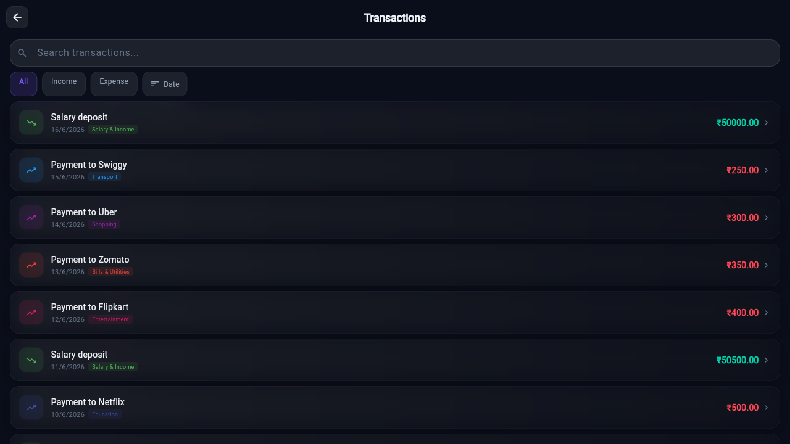
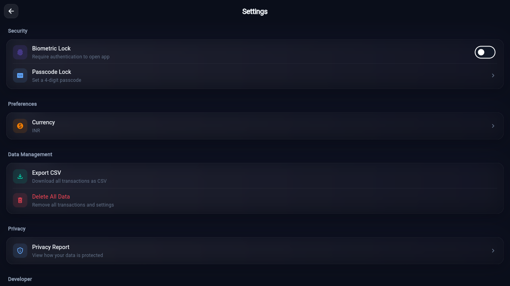
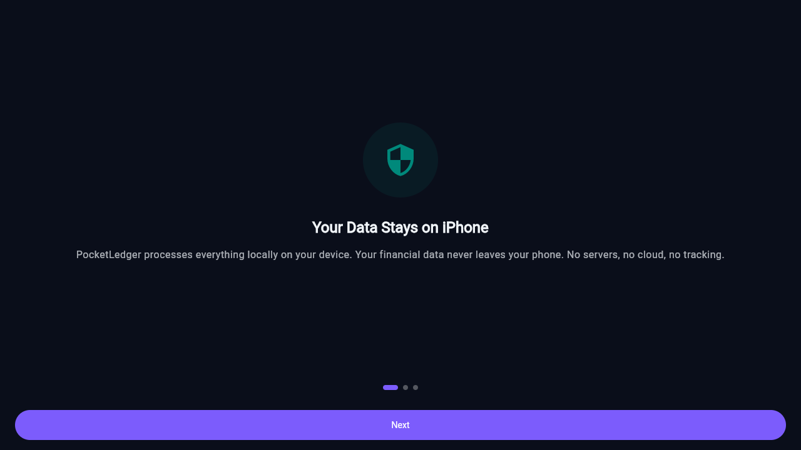

<picture>
  <source media="(prefers-color-scheme: dark)" srcset="docs/dashboard-chromium-darwin.png">
  
</picture>

# PocketLedger

> Offline-first personal finance tracker — import bank statements, auto-categorize, track budgets & credit cards. All data stays on your device.

[](https://github.com/Abhishek2r-rzp/pocketledger_flutter/actions/workflows/test.yml)
[](https://github.com/Abhishek2r-rzp/pocketledger_flutter/issues)
[](https://github.com/users/Abhishek2r-rzp/projects/1)
[](https://flutter.dev)
[](LICENSE)

---

## Quick Links

- [Project Board](https://github.com/users/Abhishek2r-rzp/projects/1) — Sprint tracking & planning
- [Issues](https://github.com/Abhishek2r-rzp/pocketledger_flutter/issues) — Bug reports & feature requests
- [Documentation](docs/Home.md) — Full docs in the repo
- [Features](docs/Features.md) — What PocketLedger can do
- [Architecture](docs/Architecture.md) — Agentic design & data flow
- [Setup Guide](docs/Setup.md) — Build & run instructions
- [Screenshots](docs/Screenshots.md) — Visual tour

---

## Features

- **📄 Import** — Parse CSV, PDF, and XLSX bank statements
- **🤖 Auto-categorize** — AI agents tag merchants & categories automatically
- **🔍 Deduplicate** — Detect and merge repeated transaction entries
- **🔄 Recurring** — Auto-detect weekly/monthly payments
- **💰 Budgets** — Track spending per category with 80% warnings
- **💳 Credit Cards** — Track limits, outstanding, and over-limit alerts
- **🏦 Accounts** — Savings, wallet, cash, investment tracking
- **🏷️ Labels** — Color-coded labels for transaction tagging
- **🔎 Search** — Filter by date, amount, category, direction, labels
- **📊 Insights** — Spending patterns, trends, and category breakdowns
- **🔒 Privacy** — Passcode lock, biometric auth, all data stays local
- **🎨 Theme** — Premium dark theme with glassmorphism design

---

## Quick Start

```bash
# Prerequisites: Flutter 3.x
git clone https://github.com/Abhishek2r-rzp/pocketledger_flutter.git
cd pocketledger_flutter

# Install dependencies
flutter pub get

# Generate drift database code
dart run build_runner build --delete-conflicting-outputs

# Run tests (317+ passing)
flutter test

# Launch on web (quickest way to try it)
flutter run -d chrome
```

---

## Tech Stack

| Layer | Technology |
|-------|-----------|
| **Framework** | Flutter 3.x (Dart) |
| **State** | Riverpod 3.x |
| **Database** | drift (SQLite) |
| **Architecture** | Multi-agent system (11 agents) |
| **Charts** | fl_chart |
| **Navigation** | GoRouter |
| **Parsing** | CSV, PDF (pdf_text), XLSX |
| **Testing** | flutter_test, mocktail, Playwright |

---

## Screenshots

| Dashboard | Transactions | Settings | Onboarding |
|-----------|-------------|----------|------------|
|  |  |  |  |

---

## Project Structure

```
lib/
├── agents/               # 11 AI agents
│   ├── categorization_agent.dart
│   ├── deduplication_agent.dart
│   ├── recurring_payment_agent.dart
│   ├── budget_agent.dart
│   └── ...
├── core/
│   ├── models/           # Domain models
│   ├── database/         # Drift schema + DAOs
│   ├── repository.dart   # Abstract repository
│   ├── data_repository.dart       # In-memory (testing)
│   ├── database_repository.dart   # SQLite (production)
│   ├── theme/            # Dark theme, glass cards
│   └── security/         # Biometrics, passcode
├── features/             # Screens & providers
│   ├── dashboard/
│   ├── transactions/
│   ├── accounts/
│   ├── labels/
│   ├── search/
│   └── ...
├── parsers/              # CSV, PDF, XLSX
├── services/             # Search, Export
└── router.dart           # GoRouter routes
```

---

## Test Suite

- **317 unit + widget tests** passing (4 pre-existing excluded)
- **`flutter test`** — All tests (CI)
- **`flutter test --platform chrome test/integration/`** — Web integration E2E
- **`npx playwright test`** — Visual regression testing
- **GitHub Actions** — Tests run on every push

---

## Links

- 📋 [Project Board](https://github.com/users/Abhishek2r-rzp/projects/1)
- 🐛 [Report a Bug](https://github.com/Abhishek2r-rzp/pocketledger_flutter/issues/new?labels=bug)
- 💡 [Feature Request](https://github.com/Abhishek2r-rzp/pocketledger_flutter/issues/new?labels=enhancement)
- 📖 [Full Documentation](docs/Home.md)
